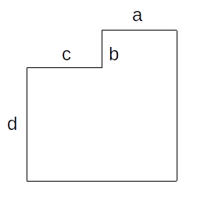
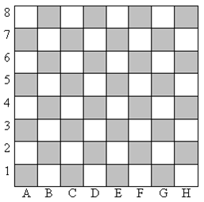

### Ввод и вывод данных print, input

1. Напишите программу, которая выводит строку "Python" без кавычек.

    Пример ввода:

    Пример вывода:
    ~~~
    Python
    ~~~

1. Напишите программу, которая напечатает букву "A" (латинскую) 133 раза подряд.

    Используйте смекалку, а не трудолюбие.

    Пример ввода:

    Пример вывода:
    ~~~
    AAAAAAAAAAAAAAAAAAAAAAAAAAAAAAAAAAAAAAAAAAAAAAAAAAAAAAAAAAAAAAAAAAAAAAAAAAAAAAAAAAAAAAAAAAAAAAAAAAAAAAAAAAAAAAAAAAAAA
    ~~~

1. Напечатайте букву "A" (латинскую) k раз подряд. Число k подается на вход.

    Пример ввода:
    ~~~
    3
    ~~~
    Пример вывода:
    ~~~
    AAA
    ~~~

1. Напишите программу, которая будет вычислять площадь фигуры, представленной на рисунке. На вход программы подаются 4 числа: длины отрезков a, b, c и d.

    Все углы у этой фигуры прямые.

    

    Подсказка: площадь прямоугольника равна произведению его длины на ширину.

    Пример ввода:
    ~~~
    1
    1
    1
    1
    ~~~
    Пример вывода:
    ~~~
    3
    ~~~

### Условия if, elif, else

1. Напишите программу, которая считывает два числа и выводит то из них, которое больше.

    Пример ввода:
    ~~~
    436
    337
    ~~~
    Пример вывода:
    ~~~
    436
    ~~~

1. Прочитайте число. Выведите -1 если оно отрицательное, 1 если оно положительное. Если число равно 0, то выведите 0. 

    Пример ввода:
    ~~~
    7
    ~~~
    Пример вывода:
    ~~~
    1
    ~~~

1. Напишите программу, которая считывает два числа и выводит номер того из них, которое больше.

    Если первое больше, то выводится "1". Если второе, то - "2". Если числа равны, то "0".

    Пример ввода:
    ~~~
    8
    11
    ~~~
    Пример вывода:
    ~~~
    2
    ~~~

1. Выведите цвет клетки доски по её координатам.

    Координаты клетки заданы двумя числами от 1 до 8. Сначала номер столбца, потом номер строки.

    

    В качестве ответа выведите "BLACK" или "WHITE" без кавычек.

    Пример ввода:
    ~~~
    1
    1
    ~~~
    Пример вывода:
    ~~~
    BLACK
    ~~~

1. Классическая задача "Fizz Buzz".
Прочитайте число. Если число делится на 3 выведите "Fizz", если на 5 – "Buzz". Если число делится на 3 и на 5 одновременно, то – "Fizz Buzz". В противном случае выведите само число. 

    Все слова выводятся без кавычек.

    Пример ввода:
    ~~~
    3
    ~~~
    Пример вывода:
    ~~~
    Fizz
    ~~~