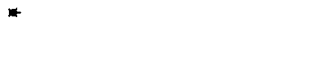
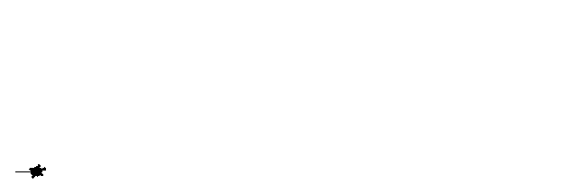
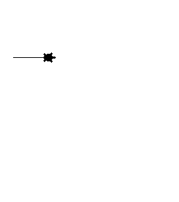

# Фракталы

## Рекурсия

Как мы видели раньше функции могут вызывать другие функции — это вполне обыденная ситуация. При этом функция может вызывать саму себя. Такой тип вызова называется рекурсивным. Самый простой пример рекурсивного вызова функции — вычисление факториала числа:

~~~python
>>> def fac(n):
...     if n == 0:
...         return 1
...     else:
...         return n * fac(n - 1)
...
>>> fac(5)
120
~~~

Конечно, эту программу можно переписать и без рекурсивных вызовов:

~~~python
>>> def fac(n):
...     f = 1
...     x = 2
...     while x <= n:
...         f *= x
...         x += 1
...
...     return f
...
>>> fac(5)
120
~~~

Отличие этих двух программ кроется в подходе к их построению. Первая написана в декларативном стиле, то есть для вычисления факториала используются его свойства, а именно n! = n*(n-1)! и 0!=1. Второй же подход использует императивный стиль: мы явно описываем, что представляет из себя факториал: n! = 1*2*…*n. В большинстве случаев один и тот же алгорит может быть легко записан, как в рекурсивной форме, так и в нерекурсивной, но существует ряд задач, для которых построение нерекурсивного алгоритма представляется весьма трудозатратным.

Количество вложенных рекурсивных вызовов называется глубиной рекурсии. В силу ограниченности вычислительных ресурсов рекурсия в компьютерных программах не бывает бесконечной — программист должен явно следить за тем, чтобы глубина рекурсивных вызовов не превышала заранее известного числа. Если программист об этом не позаботился (или же сделал это некорректно), операционная система (или интерпретатор) аварийно завершит программу по исчерпанию доступых ресурсов. Чтобы убедиться в этом, попробуйте вычислить (-5)! при помощи рассмотренного ранее примера рекурсивного алгоритма вычисления факториала.

## Фракталы

### Turtle

В следующих заданиях снова будет использоваться модуль turtle. Напомним полезные функции из этого модуля:

Команда | Значение
--------|----------
forward(X) | Пройти вперёд X пикселей
backward(X) | Пройти назад X пикселей
left(X) | Повернуться налево на X градусов
right(X) | Повернуться направо на X градусов
penup() | Не оставлять след при движении
pendown() | Оставлять след при движении
shape(X) | Изменить значок черепахи (“arrow”, “turtle”, “circle”, “square”, “triangle”, “classic”)
stamp() | Нарисовать копию черепахи в текущем месте
color() | Установить цвет
begin_fill() | Необходимо вызвать перед рисованием фигуры, которую надо закрасить
end_fill() | Вызвать после окончания рисования фигуры
width() | Установить толщину линии
goto(x, y) | Переместить черепашку в точку (x, y)

### Рисуем фрактал

Хорошим примером для иллюстрации рекурсивных алгоритмов являются задачи рисования [фракталов](https://ru.wikipedia.org/wiki/Фрактал). Фрактальные кривые, обладающие бесконечным самоподобием, не являются спрямляемыми: хоть их и можно изобразить на плоскости конечной площади, эти кривые имют бесконечную длину. Соответственно, программно их невозможно нарисовать полностью: всегда будет возможность нарисовать кривую детальнее. Поэтому, фрактальные кривые рисуют в некотором приближении, заранее фиксируя максимально допустимую глубину рекурсии.

Пример программы, использующей рекурсивные вызовы функции, чтобы нарисовать ветку:

~~~python
import turtle

turtle.speed('fastest') # увеличиваем скорость рисования

def draw(l, n):
    if n == 0: 
        # нарисовали все что хотели
        turtle.left(180)
        return

    x = l / (n + 1)
    for i in range(n):
        turtle.forward(x)
        turtle.left(45) # поворачиваем налево
        draw(0.5 * x * (n - i - 1), n - i - 1) # рисуем левую подветку
        turtle.left(90) # поворачиваем направо
        draw(0.5 * x * (n - i - 1), n - i - 1) # рисуем правую подветку
        turtle.right(135) # поворачиваем в исходную позицию 

    turtle.forward(x)
    turtle.left(180)
    turtle.forward(l)

draw(400, 5)
~~~

### Канторово множество
Нарисуйте Канторово множество. Канторово множество нулевого порядка - горизонтальный отрезок. Удалив среднюю треть получим множество первого порядка. Повторяя данную процедуру получим остальные множества.

### Кривая Коха

Нарисуйте [кривую Коха](https://wikipedia.org/ru/Кривая_Коха). Процесс её построения выглядит следующим образом: берём единичный отрезок, разделяем на три равные части и заменяем средний интервал равносторонним треугольником без этого сегмента. В результате образуется ломаная, состоящая из четырёх звеньев длины 1/3. На следующем шаге повторяем операцию для каждого из четырёх получившихся звеньев и т. д… Предельная кривая и есть кривая Коха.

Так же существует [снежинка Коха](https://wikipedia.org/ru/Кривая_Коха) - Три копии кривой Коха, построенные (остриями наружу) на сторонах правильного треугольника, образуют замкнутую кривую

