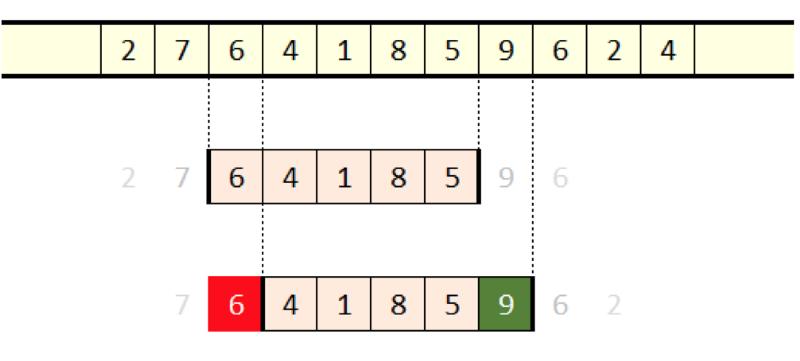
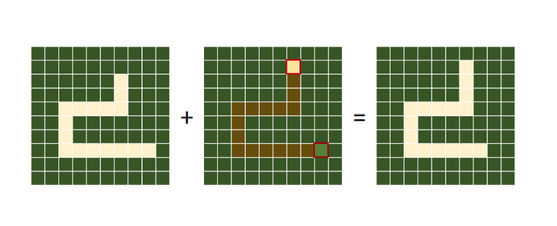

# Snake

Если вы родились в 80-х или 90-х, то наверняка слышали о Snake. То есть, скорее всего, вы потратили безумное количество времени на своём Nokia 3310, выращивая огромную змею на мелком экранчике. Что ещё мы помним о телефонах Nokia?

Их неразряжающийся аккумулятор, правда? Как такой «примитивный» телефон выдерживал долгие часы игры в «Змейку» без разрядки аккумулятора?

Короткий (и неполный) ответ: всё дело в методе скользящего окна.

Кадрирование заключается в получении состояния системы и ограничении области обзора только его частью, называемой «окном». Это создаёт разделение между алгоритмом кадрирования и алгоритмом, применяемым к тем элементам, которые видимы через окно, что упрощает оба алгоритма.

Особый случай — это состояние, состоящее из последовательности объектов, например, из массива или строки. Если задать окно, то мы увидим подпоследовательность. Теперь мы можем применить любую обработку к этому ограниченному интервалу, как будто в последовательности больше нет никаких значений. Благодаря ограничению интервала мы делаем всю задачу меньше. Теперь рассмотрим свойство скольжения: переместим окно на одну позицию вправо, и получим другую подпоследовательность, к которой тоже можно применить обработку.

И здесь начинается наше приключение. Если применять алгоритм к каждому окну по отдельности, то в результате у нас получится тактика грубого перебора.

Однако красота метода скользящего окна заключается в том, что она позволяет изменить структуру алгоритма таким образом, чтобы он использовал преимущества самого процесса смещения окна. И целью всего этого является создание более хороших и быстрых алгоритмов.

Мы можем повысить скорость выполнения практически любого алгоритма, применённого к скользящему окну, по крайней мере, теоретически. При сдвиге окна меняются только два элемента. Самый старый выбывает, и в кадр попадает самый новый.




Сдвиг элементов (красный: выбыл, зелёный: прибыл)

Догадываетесь? Змейка сама является скользящим окном! Когда змея движется, нам достаточно отрисовывать на экране всего два блока — хвост становится блоком-фоном, а бывший фон перед головой змеи становится новой головой.



Рисунок «Змейка» = скользящее окно

Результатом применения метода скользящего окна стало то, что каждый кадр игры стоит нам отрисовки максимум двух примитивных блоков, вне зависимости от длины змеи. Это позволяло реализовывать игру на примитивном «железе» без лишнего расхода заряда аккумулятора.


# Пишем змейку

первые шаги
```python
import turtle

# draw a window for the game
screen = turtle.Screen()
screen.title('Snake with turtle module')
screen.bgcolor('orange')
screen.setup(650, 650)
screen.tracer(0)
```

Рисуем границы поля
```python
# draw a game field border
border = turtle.Turtle()
border.hideturtle()
border.penup()
border.goto(-311, 311)
border.pendown()
border.goto(311, 311)
border.goto(311, -311)
border.goto(-311, -311)
border.goto(-311, 311)
```

Создаем змейку
```Python
snake = turtle.Turtle()
snake.shape('square')
```

создаем слушатели для змейки
```Python
# snake control
screen.onkeypress(lambda: snake.setheading(90), 'Up')
screen.onkeypress(lambda: snake.setheading(270), 'Down')
screen.onkeypress(lambda: snake.setheading(180), 'Left')
screen.onkeypress(lambda: snake.setheading(0), 'Right')
screen.listen()
```

дальше легко...

Окс, сейчас у нас глупый квадратик бегает по экрану, а мы хотим змея

вот так выглядит структура змея (в оригинальном виде, в дальнейшем у нас будет змей удлиняться), также нам нужно изменить наши слушатели
```Python
snake = []
for i in range(3):
    snake_segment = turtle.Turtle()
    snake_segment.shape('square')
    snake_segment.penup()
    if i > 0:
        snake_segment.color('gray')
    snake.append(snake_segment)

# snake control
screen.onkeypress(lambda: snake[0].setheading(90), 'Up')
screen.onkeypress(lambda: snake[0].setheading(270), 'Down')
screen.onkeypress(lambda: snake[0].setheading(180), 'Left')
screen.onkeypress(lambda: snake[0].setheading(0), 'Right')
screen.listen()
```

Если сейчас запустить то можно увидеть что двигается только голова (если вообще что то двигается) в то время как тело остается неподвижным. Нам нужно изменить то как змей двигается, ниже приведен пример кода.

```python
# snake body movement
for i in range(len(snake)-1, 0, -1):
    x = snake[i-1].xcor()
    y = snake[i-1].ycor()
    snake[i].goto(x, y)

# snake head movement
snake[0].forward(20)
```


