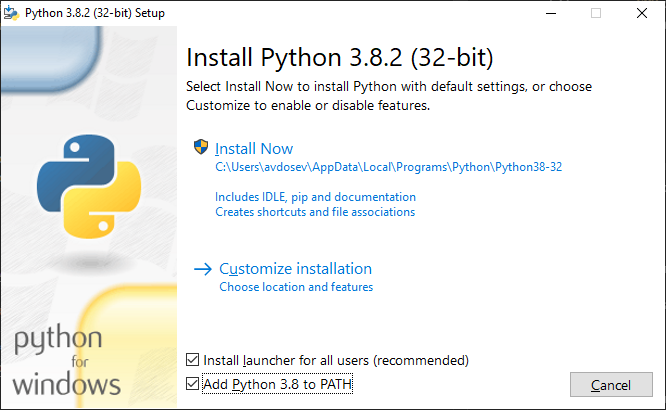

# Вводное

## Установка

Есть несколько вариантов установки Питона. Различаются они только количеством телодвижений.

### Вариант 1

Установка через пакетный менеджер. Наиболее простая установка но выглядит более сложно.

1. Устанавливаем Chocolatey
    1. Открываем `powershell` от имени администратора
    2. Копируем команду ниже и вставляем
    ~~~
    Set-ExecutionPolicy Bypass -Scope Process -Force; [System.Net.ServicePointManager]::SecurityProtocol = [System.Net.ServicePointManager]::SecurityProtocol -bor 3072; iex ((New-Object System.Net.WebClient).DownloadString('https://chocolatey.org/install.ps1'))
    ~~~
    3. Нажимаем `enter`
    4. Ждем
    5. Если появилась ошибка то значит что версия `powershell` не подходит и нужно воспользоваться вторым вариантом установки
2. Открываем `CMD` от имени администратора
3. Вбиваем этот набор команд
~~~
choco install -y python
choco install -y vscode
~~~
4. Ждем
5. Если все нормально то перезапускаем консоль
6. Проверяем корректность всего установленного
вбив `python` в консоли

### Вариант 2

Официальный сайт питона: https://www.python.org/

Либо прямая ссылка на сам [инсталятор](https://www.python.org/ftp/python/3.8.2/python-3.8.2.exe)

Редактор кода: [vscode](https://code.visualstudio.com/)

1. качаем питон
2. устанавливаем нажав `Install now` не забыв поставить галочку напротив `add python to path` 
    
    

3. Ну и везде кликаем далее
4. Аналогично предыдущим шагам делаем c Visual Code