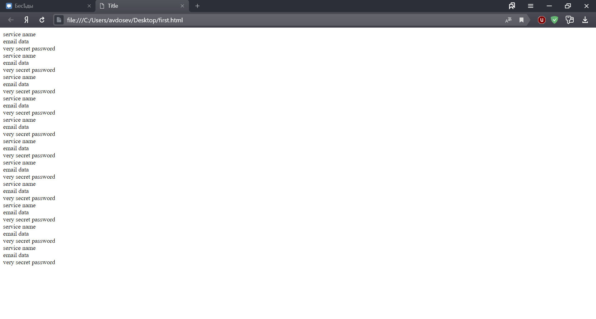
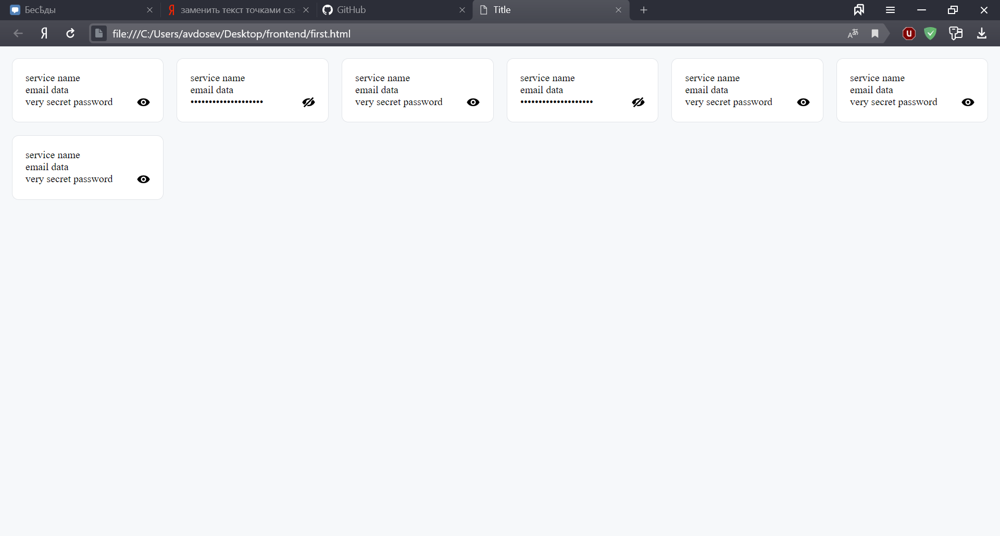

# Фронтенд

Этот этап будет разделен на мелкие под этапы:
1. html
2. css
3. javascript

Эти под-этапы в свою очередь будут разделены на теоретические и практические части.

## HTML
### Теория
html или язык гипертекстовой разметки - надмножество xml.

Во всемирной паутине HTML-страницы, как правило, передаются браузерам от сервера по протоколам HTTP или HTTPS, в виде простого текста или с использованием шифрования.

На данный момент последней версией html является HTML5

HTML — теговый язык разметки документов. Любой документ на языке HTML представляет собой набор элементов, причём начало и конец каждого элемента обозначается специальными пометками — тегами. Элементы могут быть пустыми, то есть не содержащими никакого текста и других данных. В этом случае обычно не указывается закрывающий тег (например, тег переноса строки `<br>` — одиночный и закрывать его не нужно) . Кроме того, элементы могут иметь атрибуты, определяющие какие-либо их свойства (например, атрибут href=" у ссылки). Атрибуты указываются в открывающем теге. Вот примеры фрагментов HTML-документа:

* `<strong>Текст между двумя тегами — открывающим и закрывающим.</strong>`
* `<a href="http://www.example.com">Здесь элемент содержит атрибут href, то есть гиперссылку.</a>`
* А вот пример пустого элемента: `<br>`

Регистр, в котором набрано имя элемента и имена атрибутов, в HTML значения не имеет. Элементы могут быть вложенными. Например, следующий код:

```html
<!DOCTYPE html>
<html>
   <head>
      <meta charset="utf-8" />
      <title>HTML Document</title>
   </head>
   <body>
      <p>
         <b>
            Этот текст будет полужирным, <i>а этот — ещё и курсивным</i>.
         </b>
      </p>
   </body>
</html>
```

Каждый HTML-документ, отвечающий спецификации HTML какой-либо версии, должен начинаться со строки объявления версии HTML `<!DOCTYPE …>`, которая для современной версии html выглядит  так:
```html
<!DOCTYPE html>
```

Кроме элементов, в HTML-документах есть и сущности (англ. entities) — «специальные символы». Сущности начинаются с символа амперсанда и имеют вид &имя; или &#NNNN;, где NNNN — код символа в Юникоде в десятичной системе счисления.

Например, `&copy;` — знак авторского права (&copy;). Как правило, сущности используются для представления символов, отсутствующих в кодировке документа, или же для представления «специальных» символов: `&amp;` — амперсанда (&amp;), `&lt;` — символа «меньше» (&lt;) и `&gt;` — символа «больше» (&gt;), которые некорректно записывать «обычным» образом, из-за их особого значения в HTML.

Основные теги:

| тег | значение |
|----|----|
| `<a href="URL">...</a>` <br> `<a name="#идентификатор">...</a>` | Ссылка  | 
| `<body...</body>` | Хранения содержания веб-страницы (контента), отображаемого в окне браузера. | 
| `<div>...</div>` | Элемент является блочным элементом и предназначен для выделения фрагмента документа с целью изменения вида содержимого. Как правило, вид блока управляется с помощью стилей. Чтобы не описывать каждый раз стиль внутри тега, можно выделить стиль во внешнюю таблицу стилей, а для тега добавить атрибут class или id с именем селектора. | 
| `<head>` | Предназначен для хранения других элементов, цель которых — помочь браузеру в работе с данными. | 
| `<input type="...">` | Позволяет создавать разные элементы интерфейса и обеспечить взаимодействие с пользователем. Главным образом `<input>`предназначен для создания текстовых полей, различных кнопок, переключателей и флажков. Хотя элемент `<input>` не требуется помещать внутрь контейнера `<form>`, определяющего форму, но если введенные пользователем данные должны быть отправлены на сервер, где их обрабатывает серверная программа, то указывать `<form>` обязательно. То же самое обстоит и в случае обработки данных с помощью клиентских приложений, например, скриптов на языке JavaScript. Основной атрибут тега, определяющий вид элемента — [type](//htmlbook.ru/html/input/type). | 

Более подробно обо всех элементах - [http://htmlbook.ru/html](http://htmlbook.ru/html)

### Практика

Для создания html есть два пути:
1. Серверный рендер
2. Клиентский рендер

У обоих вариантов есть свои плюсы и минусы. Заостряться на которых пока нет ни сил ни желания (может потом оно появится).

Важно одно оба варианта имеют право на жизнь и пока мы расмотрим серверный рендер на базе html-templates или шаблоны (есть и другие варианты для серверного рендера).

Шаблон — это всего лишь текстовый файл с HTML-кодом и дополнительными элементами разметки, которые обозначают динамический контент.
Последний станет известен в момент запроса. Процесс, во время которого динамическая разметка заменяется, и генерируется статическая HTML-страница, называется отрисовкой (или рендерингом) шаблона. 
Во Flask есть встроенный движок шаблонов Jinja, который и занимается тем, что конвертирует шаблон в статический HTML-файл.

Jinja — один из самых мощных и популярных движков для обработки шаблонов для языка Python. 
Он должен быть известен пользователям Django. Но стоит понимать, что Flask и Jinja – два разных пакета, и они могут использоваться отдельно.

По умолчанию, Flask ищет шаблоны в подкаталоге templates внутри папки приложения. Это поведение можно изменить, передав аргумент template_folder конструктору Flask во время создания экземпляра приложения.

На базе этого и напишем базовую страницу со всеми паролями.

```html
<!DOCTYPE html>
<html lang="en">
<head>
    <meta charset="UTF-8">
    <title>Title</title>
</head>
<body>
    <main>
        ...
    </main>
</body>
```

Внутри тега main мы и будем хранить карточки со всеми паролями 

Напишем заготовку для карточки. Элементы которые зависят от данных мы будем помечать так `[[ account.field_name ]]` 

> **Важно!**
>
> я использовал квадратные скобки хотя нужно использовать фигурные (либо править настройки Jinja чтобы она распознавала квадратные)


```html
<div class="account_card">
    <div class="account_card_service">[[ account.service ]]</div>
    <div class="account_card_email">[[ account.email ]]</div>
    <div class="account_card_password">[[ account.password ]]</div>
</div>
```

На самом деле `[[ account.field_name ]]` это часть синтаксиса Jinja, и мы просто вставляли реальное содержимое какого-то аккаунта. Но ведь аккаунтов много а карточка одна. Да, для этого мы будем использовать цикл `for`. Ага, он тоже есть в Jinja.

```html
<!DOCTYPE html>
<html lang="en">
<head>
    <meta charset="UTF-8">
    <title>Title</title>
</head>
<body>
    <main>
        [% for account in accounts %]
        <div class="account_card">
            <div class="account_card_service">[[ account.service ]]</div>
            <div class="account_card_email">[[ account.email ]]</div>
            <div class="account_card_password">[[ account.password ]]</div>
        </div>
        [% endfor %]
    </main>
</body>
```
Все, далее нам нужно будет просто при начале рендера подавать список аакаунтов которые нужно рендерить.

```python
from flask import Flask, render_template
from DataBase import DataBase # Наш класс базы данных

app = Flask()
accounts_db = DataBase(f'data/accounts.json')

@app.route('/')
def page_all_accounts():
    accounts = accounts)db.get_all()
    return render_template('accounts.html', accounts=accounts)


if __name__ == '__main__':
    app.run()
```

## CSS
### Теория

CSS (Cascading Style Sheets — каскадные таблицы стилей) — формальный язык описания внешнего вида документа, написанного с использованием языка разметки.

До появления CSS оформление веб-страниц осуществлялось исключительно средствами HTML, непосредственно внутри содержимого документа. Однако с появлением CSS стало возможным принципиальное разделение содержания и представления документа. За счёт этого нововведения стало возможным лёгкое применение единого стиля оформления для массы схожих документов, а также быстрое изменение этого оформления.

Преимущества:

* Несколько дизайнов страницы для разных устройств просмотра.
* Уменьшение времени загрузки страниц сайта за счёт переноса правил представления данных в отдельный CSS-файл. В этом случае браузер загружает только структуру документа и данные, хранимые на странице, а представление этих данных загружается браузером только один раз и может быть закэшировано.
* Простота последующего изменения дизайна. Не нужно править каждую страницу, а достаточно лишь изменить CSS-файл.

Недостатки:

* Часто встречается необходимость на практике исправлять не только один CSS-файл, но и теги HTML, которые сложным и ненаглядным способом связаны с CSS селекторами, что не облегчает применение единых файлов стилей и значительно увеличивает время редактирования и тестирования.

Базовый синтаксис:

```
селектор {
    свойство: значение;
    свойство: значение;
    свойство: значение;
}
```

Виды селекторов

Универсальный селектор

```css
* {
   margin: 0; 
   padding: 0; 
}
```
Селектор тегов
```css
p {
   font-family: arial, helvetica, sans-serif; 
}
```
Селектор классов
```css
.note {
   color: red; 
   background-color: yellow; 
   font-weight: bold; 
}
```
Селектор идентификаторов
```css
#paragraph1 {
    margin: 0; 
}
```

### Практика

Будем вести нашу страницу к красоте. Все равно хуже уже не будет.

Пускай у нас будет такой хтмл
```html
<!DOCTYPE html>
<html lang="en">
<head>
    <meta charset="UTF-8">
    <!-- Указывается титульник страницы -->
    <title>Title</title>
    <!-- Ссылка браузеру где брать стили -->
    <link rel="stylesheet" href="style.css">
</head>
<body>
    <main>
        <div class="account_card_container">
            <div class="account_card">
                <div class="account_card_service">service name</div>
                <div class="account_card_email">email data</div>
                <div class="account_card_password">very secret password</div>
            </div>
            <!-- Тут еще десятка два таких карточек --->
        <div>
    </main>
</body>
```

Различие с предыдущим в том что добавился `div` с классом `..._container`. Это важная особенность css, мы создаем контейнеры чтобы манипулировать расположением элементов по горизонтали и вертикали.

Для этого можно использовать [Flex](https://html5book.ru/css3-flexbox/) или [Grid](https://css-live.ru/articles/znakomstvo-s-css-grid-layout.html).

Я снова не буду останавливаться на этом подробно тк эта гора текста увеличится еще раза 2. Вам хватит и того что я копипасщу с вики. 



В общем как-то так будет выглядеть наш хтмл без стилей. Как по мне очень даже минималистично и функционально.

Но привередливый читатель скажет, что хочется красивостей и негоже проекту за 0,000,000$ быть таким не красивым. А я соглашусь.

В общем не буду вас мучать текстом и покажу как должно стать а потом расскажу как.



> \- Как какать? \
> \- Это нужно почувствовать. Если почувствуешь, то просто плыви по течению.

Лан, это было небольшое отступление

Файлики которые нужно скачать:
<a download href="./img/view.svg">view.svg</a>
<a download href="./img/no-view.svg">no-view.svg</a>

Они используются как кнопка скрыть/показать пароль

Создаем переменные для цветов.
```css
:root {
    --background-color: #f6f8fa;
    --card-color: white;
    --card-border-color: #e1e4e8;
}
```

Задаем основной цвет нашего хтмл

```css
html {
    background-color: var(--background-color);
}
```

Добавляем стили для карточки с паролем

```css
.account_card {
    border-radius: 10px;
    border-color: var(--card-border-color);
    background-color: var(--card-color);
    border-width: 1px;
    border-style: solid;
    padding: 20px;
    margin: 10px;
}
```
Конечно, просто список карточек это не топ, поэтому сделаем это в виде таблички. 
Её особенность в том что она сама выбирает размеры и количество колонок, это очень удобно, особенно, когда нужно делать адаптив под мобилки.
```css
.account_card_container {
    display: grid;
    grid-template-columns: repeat(auto-fit, minmax(250px, 1fr));

    align-items: center;
    justify-content: center;
}
```
Добавляем напротив пароля иконку скрытый/закрытый. (ХТМЛ для иконки есть мы просто меняем его стиль) 
```css
.icon {
    width: 20px;
    height: 20px;
}

.view-icon {
    content: url(./view.svg);
}

.no-view-icon {
    content: url(./no-view.svg);
}
```
Выравниваем текст пароля и иконку.
```css
.account_card_password {
    display: inline-flex;
    justify-content: space-between;
    width: 100%;
}

.secret-text {
    -webkit-text-security:disc;
    /* this code not working on firefox */
}
```

Хоба, готово

## JavaScript

### Практика

Нужно добавить к head подключение скрипта

```html
<head>
    <!-- other tags -->
    <script src="script.js" defer></script>
</head>
```

Внутри файла пишем код.


```js
// добавляем событие
document.addEventListener('click', event => {
    // создаем неизменяемую переменную с элементом который испустил событие
    const element = event.target;
    // определям кто испустил событие
    const is_icon = element.classList.contains('no-view-icon') ||
                    element.classList.contains('view-icon');
    if (is_icon) {
        // меняем стили у иконки
        element.classList.toggle('no-view-icon');
        element.classList.toggle('view-icon');
        // меняем стили у родителя
        element.parentNode.classList.toggle('secret-text');
    }
});
```